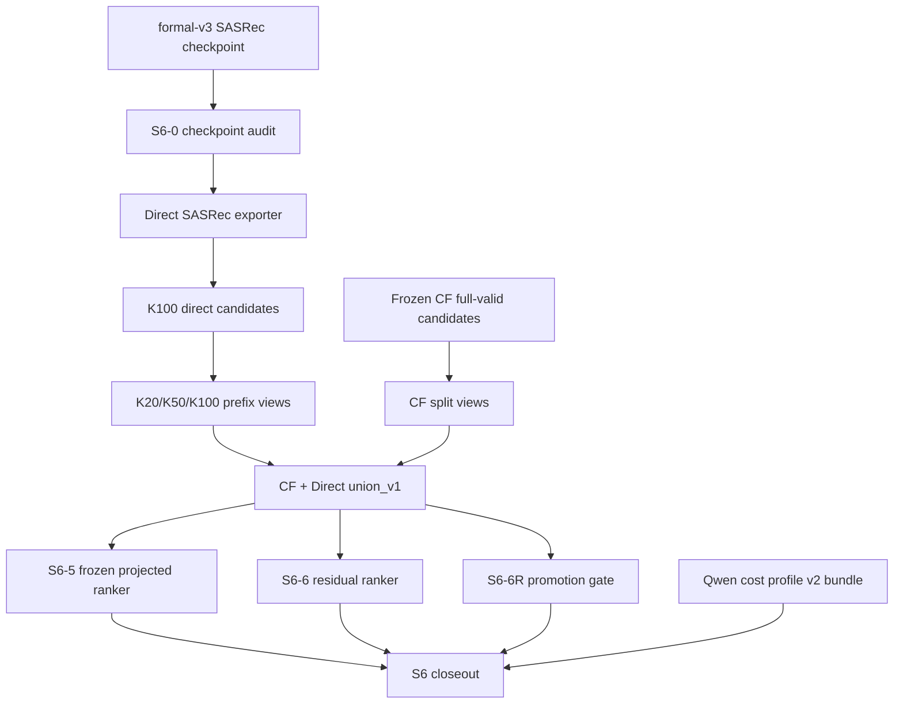

# S6 工程实现与代码主线

## 1. Repository-level Architecture

S6 的工程主线位于 `/home/dell/projects/MiniOneRec`，围绕四类资产组织：

- source scripts：`export_sasrec_direct_candidates.py`、`scripts/s6_*.py`。
- validation evidence：`results/s6_cost_aware_aux/Industrial_and_Scientific/`。
- returned AutoDL bundles：`incoming/s6_formal_direct_sasrec/`、`incoming/s6_qwen_cost_profile/`。
- documentation：`docs/s6_*.md` 与 `docs/s6_final/`。

所有 S6 代码默认拒绝 test path，正式实验 evidence 中 `test_read=false`。S6 final 文档阶段不运行 inference、generation、ranking 或 training。

## 2. Data and Artifact Flow



## 3. Checkpoint Compatibility Flow

File: `scripts/s6_sasrec_checkpoint_audit.py`

主要函数和类：

- `TensorMeta`：记录 checkpoint tensor metadata。
- `CheckpointUnpickler`、`restricted_checkpoint_load`：受限加载 checkpoint，避免任意 pickle 执行。
- `load_float_storage`：读取 tensor storage。
- `l2_normalize`：与 exported embedding 对齐时使用。
- `state_summary`：汇总 state dict。
- `compare_embedding`：比较 checkpoint embedding 与 exported embedding。
- `torch_status`：记录本地 torch 可用性。
- `build_report`：生成兼容性报告。

输入：formal-v3 checkpoint、SASRec embedding export、config。输出：`s6_checkpoint_compatibility_report.json`。失败条件包括 checkpoint hash 不匹配、结构缺失、embedding 不一致、无法解析必要 tensor。

## 4. Direct Candidate-export Flow

File: `export_sasrec_direct_candidates.py`

主要函数：

- `load_checked_config`：加载 config 并核对 checkpoint report。
- `build_runtime_model`：恢复完整 SASRec runtime model。
- `stable_topk`：稳定 top-K 排序。
- `score_features`：记录 direct score sidecar。
- `rank_metrics`：计算 HR/NDCG/MRR。
- `make_candidate_rows`：构造 `candidates.jsonl` 与 feature rows。
- `write_view`：写 K20/K50/K100 view。
- `export_candidates`：主流程。

输入是 validation CSV split、checkpoint/config、item mapping。输出包括 `candidates.jsonl`、`candidate_features.jsonl`、`candidate_report.json`。失败条件包括 existing output overwrite、checkpoint mismatch、non-finite score、非法 item、row alignment 问题。

## 5. Formal Validation Flow

File: `scripts/audit_s6_formal_direct_sasrec.py`

主要函数：

- `verify_outer_sha`、`verify_internal_sha`：验证 AutoDL returned bundle。
- `safe_extract`：安全解包。
- `audit_candidate_view`：审计单个 split/K view。
- `audit_prefix_consistency`：验证 K20/K50 是 K100 prefix。
- `audit_cf_alignment`：核对 frozen CF valid artifact alignment。
- `aggregate_runtime`：汇总 direct runtime。
- `split_stability`：检查 split 间稳定性。
- `recommend_k`：给出 K selection 建议。
- `build_metric_table`、`aggregate_metrics_by_k`：生成 formal metric table。
- `audit`：主审计入口。

输出：`s6_3_formal_direct_sasrec_audit_report.json`。失败条件包括 bundle hash mismatch、row/target/history mismatch、prefix inconsistency、invalid/duplicate/non-finite 候选、test path。

Smoke 审计文件 `scripts/audit_s6_direct_sasrec_smoke.py` 提供类似的 bundle 验证、row safety 和 deterministic smoke closeout。

## 6. CF Split-view Generation

File: `scripts/s6_cf_direct_union_validation.py`

关键函数：

- `load_valid_rows`：根据 validation split manifest 读取 valid CSV，并拒绝 test path。
- `filter_cf_split`：从 frozen CF full-valid candidates 中切出 valid_fit/select/gate。
- `validate_row_alignment`：核对 row_index、target、history。
- `filter_rows_by_expected`：按 split expected rows 过滤。

输出路径：`results/s6_cost_aware_aux/Industrial_and_Scientific/cf_split_views/union_v1/`。

## 7. Candidate Union and Provenance

同一文件 `scripts/s6_cf_direct_union_validation.py` 负责 union：

- `merge_union_row`：合并 CF row 和 direct row，保留 `from_cf`、`from_sasrec_direct`、`overlap`、source rank。
- `merge_union_rows`：批量合并。
- `union_metrics`：计算 candidate uplift、duplicate、invalid、provenance failure。
- `dual_qwen_metrics`、`merge_dual_rows`：只作为 S5 dual-Qwen reference comparison。
- `select_k`：执行 smallest-K-passing-gate。
- `run_validation`：主流程。

Canonical K20 union 路径：

`results/s6_cost_aware_aux/Industrial_and_Scientific/union/union_v1/{split}/k20/candidates.jsonl`

K50/K100 是 ablation。

## 8. Frozen Feature Projection

File: `scripts/s6_frozen_ranker_validation.py`

关键函数：

- `load_frozen_config`：加载 S5 frozen config，核对 lambda、source_bonus、model SHA。
- `load_model_and_contract`：加载 frozen model 和 feature contract。
- `source_aware_rrf_config`：构造 fixed RRF baseline。
- `ranked_with_feature_hash`：应用 frozen projected ranker 并记录 feature hash。
- `metrics_for_orders`：统一计算 ranking metrics、CF preservation、direct recovery。
- `baseline_metrics`：生成 CF-only、direct-order、fixed RRF。
- `build_samples_for_split`：从 CF split 与 union 构造样本。
- `aggregate_named_metrics`：聚合 split。
- `run`：主流程。

失败条件包括 frozen model SHA mismatch、feature order mismatch、direct raw-score feature 进入 projection、overwrite、test path。

## 9. Ranker Evaluation

S6-5 输出：

- `results/s6_cost_aware_aux/Industrial_and_Scientific/frozen_ranker/frozen_ranker_v1/{split}/ranked_candidates.jsonl`
- `results/s6_cost_aware_aux/Industrial_and_Scientific/frozen_ranker/frozen_ranker_v1/{split}/metrics.json`
- `results/s6_cost_aware_aux/Industrial_and_Scientific/s6_5_frozen_ranker_validation_report.json`

它是最强 validated ranking result，但 valid_select CF preservation 未达 97%。

## 10. Residual-ranker Implementation

File: `scripts/s6_lightweight_ranker_validation.py`

关键函数：

- `feature_names`：定义特征并拒绝泄漏命名。
- `make_feature_rows`：构造 candidate-level feature rows。
- `fit_normalizer`：只用 valid_fit 拟合 normalization。
- `train_pairwise`：pairwise logistic residual 训练。
- `scores_by_query`：计算 `frozen_ranker_score + alpha * clipped_residual_score`。
- `apply_cf_quota`：确定性 CF head quota。
- `rank_config`：应用单个配置。
- `passes_fit_select`：检查 frozen gates。
- `selection_key`：选择 passing config。
- `run`：主流程。

S6-6 使用 64 个预声明配置。没有配置通过，所以不写 selected model，不打开 valid_gate。

## 11. Promotion-gate Implementation

File: `scripts/s6_direct_promotion_gate_validation.py`

关键函数：

- `feature_names`：promotion pair 特征定义。
- `direct_exclusive_items`：只选择 direct-exclusive candidates。
- `boundary_items`：构造 CF top20 tail boundary。
- `pair_features`：构造 direct-vs-boundary pair features。
- `build_training_pairs`：valid_fit 内构造 positive promotion / negative protection pairs。
- `train_binary_logistic`：训练 pairwise logistic promotion classifier。
- `calibrate_thresholds`：只用 valid_fit 校准 threshold。
- `policy_grid`：生成最多 12 个预声明 policies。
- `apply_promotion_policy`：执行 CF-anchored tail replacement。
- `metric_definition_reconciliation`：区分 236 与 268 的定义。
- `passes_fit_select`、`selection_key`：gate 与选择。
- `run`：主流程。

没有 policy 通过 fit/select，所以 valid_gate 未打开。

## 12. Cost-profiling Flow

File: `scripts/s6_cost_evidence_closeout.py`

关键函数：

- `parse_sha_file`：读取 v2 bundle SHA。
- `safe_extract`：临时目录安全解包。
- `verify_internal_hashes`：验证内部 hash manifest。
- `elapsed_seconds_from_gnu_time`：解析 GNU time wall-clock。
- `audit_bundle`：审计 bundle、配置、row count、timing、hardware。
- `update_stage_report`：更新 S6 stage closeout JSON cost section。
- `write_cost_doc`：写 cost closeout doc。
- `update_stage_doc`：更新 `docs/s6_stage_closeout.md` cost section。

v1 cost profile 因 GNU time 缺失、exit code 127，被明确排除。

## 13. Artifact Directory Structure

```text
results/s6_cost_aware_aux/Industrial_and_Scientific/
  s6_checkpoint_compatibility_report.json
  s6_validation_split_manifest.json
  s6_2_smoke_audit_report.json
  s6_3_formal_direct_sasrec_audit_report.json
  s6_4_union_validation_report.json
  s6_5_frozen_ranker_validation_report.json
  s6_6_lightweight_ranker_validation_report.json
  s6_6r_direct_promotion_gate_report.json
  s6_stage_closeout_report.json
  s6_cost_evidence_report.json
  cf_split_views/union_v1/
  union/union_v1/
  frozen_ranker/frozen_ranker_v1/
  lightweight_ranker/lightweight_v1/
  direct_promotion/promotion_v1/
  s6_final_archive/
```

## 14. Reproduction Commands

轻量 closeout reproduction：

```bash
cd /home/dell/projects/MiniOneRec
python3 scripts/s6_stage_closeout_audit.py
python3 scripts/s6_cost_evidence_closeout.py
python3 scripts/s6_final_artifact_inventory.py --overwrite
```

完整 artifact tree hash 是手动命令，不由 Codex 执行：

```bash
python3 scripts/s6_final_artifact_inventory.py --full-hash --overwrite
```

## 15. Failure Handling and Overwrite Protection

S6 scripts 普遍采用：

- `reject_test_path`：拒绝 test/final_test path。
- `reject_existing`：拒绝覆盖已有非空输出。
- SHA256 check：验证 bundle、checkpoint、model、candidate artifacts。
- row alignment check：验证 `row_index`、target、history。
- deterministic hash：验证 feature/ranking 输出稳定。

## 16. Determinism and Hash Verification

Direct retrieval smoke/deterministic rerun给出 byte-identical candidates 和 candidate_features。Formal bundle 和 cost bundle 都有外部 SHA 与内部 hash manifest。S6 final inventory 默认记录 small-file SHA，并提供手动 full hash 模式。

## 17. Test Coverage

相关测试：

- `tests/test_s6_checkpoint_audit.py`
- `tests/test_s6_direct_sasrec_candidates.py`
- `tests/test_s6_smoke_audit.py`
- `tests/test_s6_validation_split.py`
- `tests/test_s6_cf_direct_union_validation.py`
- `tests/test_s6_frozen_ranker_validation.py`
- `tests/test_s6_lightweight_ranker_validation.py`
- `tests/test_s6_direct_promotion_gate_validation.py`
- `tests/test_s6_stage_closeout_audit.py`
- `tests/test_s6_cost_evidence_closeout.py`
- `tests/test_s6_final_artifact_inventory.py`

这些测试覆盖路径拒绝、overwrite 保护、指标计算、feature contract、gate isolation、cost evidence parsing 和 inventory allowlist。
